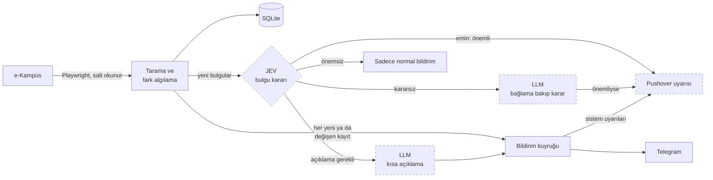
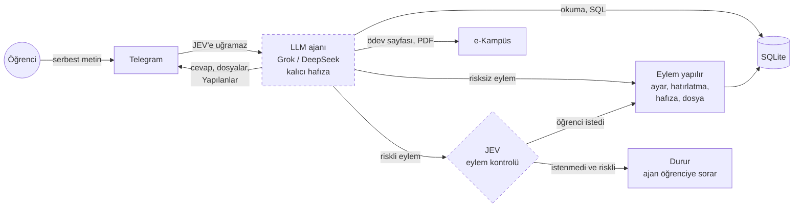

# e-Kampüs Asistanı

İstanbul Ticaret Üniversitesi e-Kampüs sistemi (Toltek TCampus) için Telegram üzerinden çalışan, ADHD dostu kişisel öğrenci asistanı.

e-Kampüs yeni bir ödev, duyuru ya da not girildiğinde öğrenciye haber vermiyor. Bir şeyin değişip değişmediğini anlamak için siteye sürekli girip bakmak gerekiyor; dikkat dağınıklığı yaşayan biri için bu, kaçan teslim tarihleri demek.

Bu proje siteyi düzenli aralıklarla kontrol eder ve önemli olan her şeyi Telegram'a yazar. Teslimlerden önce hatırlatır, her sabah günün özetini çıkarır. Sohbete normal cümleyle yazılan her şeyi bir LLM ajanı karşılar: sitedeki gerçek veriye bakarak cevap verir, botu da yönetir. Örneğin "cuma 18'e kadar rahatsız etme", "yarın 10'da raporu hatırlat" ya da "Ağlar'ı bıraktım, aklında olsun" demek yeter.

## Özellikler

- **Takip:** Ödevler ve teslim durumu, notlar, duyurular, ders materyalleri, canlı dersler ve sınavlar.
- **Bildirim:** Yeni ya da değişen her şey Telegram'a anında gelir. Ödev ayrıntısı ve dosyalar mesajdaki butonlarla açılır.
- **Hatırlatma:**
  - Teslim edilmemiş ödevler için 24 ve 3 saat kala, canlı dersten 15 dakika önce.
  - Her sabah günün özeti.
  - Öğrencinin kendi kurduğu saatli hatırlatmalar.
- **LLM ajanı:** Sohbete yazılan mesajı Grok ya da DeepSeek araçlarla cevaplar ve botu yönetir:
  - **Site:** Siteyi hemen kontrol edip yeni gelenleri tek tek söyler. Ödev sayfasını canlı açar, ekleri ve materyalleri (bir seferde 10'a kadar) gönderir. Kilitlenen girişi tekrar dener.
  - **Belgeler:** PDF materyalleri ve ödev eklerini okur, içinden soru cevaplar, kaynak sayfayı söyler. PDF gönderdiğinde okumayı teklif eder; gönderilen PDF'nin altında "Oku ve özetle" butonu çıkar.
  - **Bildirimler:** Belirli bir saate kadar sessiz mod (acil olanlar gelsin ya da hiçbir şey gelmesin). Bildirim türlerini, özellikleri ve tek bir dersi kapatıp açar. Biriken bildirimleri gösterip hemen gönderir, geçmiş bir bildirimi tekrar yollar.
  - **Hatırlatmalar:** Saatli hatırlatma kurar, erteler, iptal eder. Bir ödev için ek hatırlatma kurar ("1 saat kala da") ya da otomatik hatırlatmalarını susturur. Ödevi "teslim ettim" olarak işaretler.
  - **Durum ve ayarlar:** Aktif hatırlatma takvimini, botun durumunu ve veritabanını gösterir; veritabanına salt okunur SQL ile bakar. Sabah özetini hemen gönderir, özet ve gece saatlerini değiştirir, erişim uyarısı eşiğini ayarlar.

  Yaptığı her değişiklik cevabın altında "Yapılanlar" olarak listelenir.
- **Eylem kontrolü (JEV):** Ajan bir şeyi kapatmak, susturmak ya da silmek gibi riskli bir eylem yapmadan önce JEV'e sorar: öğrenci bunu açıkça istedi mi, riskli mi? İstenmemiş riskli eylem durdurulur ve ajan ne istediğini sorar. Döngüde insan yoktur; bir öneriyi "evet" diye onaylamak da istek sayılır.
- **Kalıcı hafıza:** Ajan, öğrencinin söylediği kalıcı tercihleri ve bilgileri (bırakılan ders, çalışma saatleri…) kendisi not eder ve sonraki her cevapta dikkate alır. Notlar `/hafiza`'dan görülür ve silinir.
- **Karar katmanı (JEV):** Her yeni bulgu önce TypeSafe JEV'e sorulur.
  - JEV bulgunun teslim gerektirip gerektirmediğine, sınavla ya da tarih değişikliğiyle ilgili olup olmadığına bakar.
  - Uyarı gönderilip gönderilmeyeceğine ve LLM'in açıklama yazıp yazmayacağına karar verir.
  - Emin olmadığı durumları LLM'e bırakır.
- **Uyarı yöneticisi:** Bildirim türleri açılıp kapatılabilir; gece modu ve iki seviyeli sessiz mod vardır. Siteye erişilemediğinde açıklamalı uyarı gelir.
- **Sistem izleme:** Çökme, takılma, hata artışı, siteye erişilememesi ve giriş sorunları Pushover'a bildirilir. Takılan bot kendini yeniden başlatır.
- **İsteğe bağlı özellikler:** LLM, JEV ve Pushover anahtarı varsa çalışır ve `/ayarlar`'dan açılıp kapatılır. Anahtarı olmayan özelliği bot açılışta, `/durum`'da ve `/ayarlar`'da "çalışmıyor: .env'de X yok" diye bildirir. Bot bunların hiçbiri olmadan da takip, bildirim ve hatırlatma yapar.
- **Güvenilirlik:** Hiçbir bildirim kaybolmaz ya da iki kez gelmez.

## Nasıl çalışır

Bot iki hattan oluşur: taramadan gelen **bulgular** ve öğrencinin yazdığı **sohbet**. JEV ikisinde de bir karar noktasında durur ama farklı görevle: bulgu hattında öncüdür, sohbet hattında bekçidir. Sohbetin kendisi JEV'e hiç uğramaz.

### Bulgu hattı: JEV öncü



Bot belirli aralıklarla e-Kampüs'e girer; ders sayfalarını, takvimi ve duyuruları okur. Okuduğu her şeyi bir önceki durumla karşılaştırır. Yeni ya da değişen her kayıt bir bildirime dönüşür ve Telegram'a iletilene kadar kuyrukta bekler.

Her yeni bulgu ayrıca JEV'e gider:
- **Emin olduğunda:** JEV öne çıkan uyarıyı kendisi gönderir; uyarı kararı için LLM'e gidilmez.
- **Kararsız kaldığında:** Kararı LLM verir; LLM gerekirse araçlarla bağlama bakar.
- **Açıklama gerektiğinde:** LLM kısa bir açıklama yazar, asıl bildirimden sonra gelir.
- **Önemsiz bulgularda:** Sadece normal bildirim gelir.

### Sohbet hattı: JEV bekçi



Sohbete yazılan mesaj doğrudan LLM ajanına gider. Ajan okuma araçlarıyla kayıtlara, hatırlatma takvimine, botun durumuna ve salt okunur SQL ile veritabanına bakar. Site araçlarıyla ödev sayfasını açar ve PDF okur. Eylem araçlarıyla ayarları, hatırlatmaları ve hafızayı değiştirir, dosya gönderir.

Risksiz eylemler hemen yapılır. Kapatma, susturma ya da silme gibi riskli bir eylemden önce JEV'e sorulur; öğrenci açıkça istemediyse eylem durur ve ajan ne istendiğini sorar. Her eylem cevabın altında "Yapılanlar" olarak listelenir.

### JEV'in iki görevi

| | Bulgu kararı | Eylem kontrolü |
|---|---|---|
| Ne zaman | Taramada her yeni ya da değişen bulgu | Ajan riskli bir eylem yapmadan hemen önce |
| JEV'e giden | Bulgunun metni ve kodda hesaplanmış gerçekler (kalan saat, teslim durumu, tarih öne mi alındı) | Öğrencinin mesajı, son birkaç mesaj ve önerilen eylem |
| Sorular | Teslim gerektiriyor mu, sınavla mı ilgili, tarih değişikliği mi, eylem gerekli mi, açıklama işe yarar mı, hemen uyarılsın mı | Öğrenci bunu açıkça istedi mi, eylem riskli mi |
| Karar (kodda) | Uyarı olasılığı %80 ve üstü: uyarı. %30-80: LLM'e sor. %30 ve altı: uyarı yok. Açıklama olasılığı %60 ve üstü: LLM açıklar. | İstendi %60 ve üstü: yapılır. İstendiği belli değilse sadece risk %25'in altındaysa yapılır, yoksa durur. |
| JEV kapalıysa | Bulgular doğrudan LLM'e gider | Kontrol yapılmaz, eylem yapılır |
| LLM kapalıysa | Kararsız bulgular kaçmasın diye uyarı olarak gider | Sohbet ajanı da kapalıdır |

Bulgu kararındaki eşikler `.env`'den ayarlanır (`JEV_PUSH_HIGH`, `JEV_PUSH_LOW`, `JEV_EXPLAIN_MIN`). Kararların hepsi `/llmlog`'da olasılıklarıyla birlikte görünür.

**Kesik çerçeveli bileşenler isteğe bağlıdır:** JEV, LLM ve Pushover anahtarı yoksa ya da `/ayarlar`'dan kapatılmışsa devre dışı kalır ve bot bunu söyler. Pushover kapalıysa uyarılar Telegram'a gelir.

**Bulgu hattında ajanın eylem ve site araçları yoktur.** Böylece site metnine gömülü bir talimat botun ayarlarını değiştiremez.

Yanlış alarm vermemek için algılama temkinli çalışır:
- İlk kurulumda var olan kayıtlar bildirilmez.
- Siteden geçici olarak kaybolan bir kayıt "silindi" sayılmaz.
- Sitenin yapısı değişirse "yeni bir şey yok" denmez, uyarı verilir.

## Teknolojiler

| Alan | Kullanılan |
|---|---|
| Dil | Python 3.12+ |
| Site erişimi | Playwright (Chromium), BeautifulSoup |
| Bot | python-telegram-bot 22 (asyncio, JobQueue) |
| Veri | SQLite |
| LLM | OpenAI uyumlu API: xAI Grok, DeepSeek |
| Karar katmanı | TypeSafe JEV |
| Belge okuma | pypdf |
| Uyarılar | Pushover (httpx) |
| Çalıştırma | Docker, Docker Compose, Windows Görev Zamanlayıcı |
| Test | pytest |

## Proje yapısı

```
ekampus/
  config.py      ayarlar (ortam değişkenleri)
  features.py    isteğe bağlı özellikler: anahtar ve aç/kapa durumu
  browser.py     Playwright oturumu ve login koruması
  scan.py        tarama turu: kaynakları okuyup kayıtları kurar
  parse.py       sayfa ayrıştırıcıları
  detect.py      önceki durumla karşılaştırma, olay üretimi
  reminders.py   teslim hatırlatma ve canlı ders kuralları
  store.py       SQLite: kayıtlar, bildirim kuyruğu, sohbet geçmişi, hafıza, LLM kayıtları
  engine.py      tarama zamanlaması, sağlık uyarıları, sessiz mod, bildirim gönderimi
  jev.py         JEV istemcisi ve bulgunun karar katmanına giden hali
  router.py      bulgu yönlendirici: JEV, LLM ve uyarı arasında karar
  agent.py       ajanın araç kutusu: okuma, site ve eylem araçları
  guard.py       riskli eylemlerden önce JEV kontrolü
  documents.py   PDF'den sayfa sayfa metin
  llm.py         LLM asistanı: sohbet, bulgu değerlendirmesi, açıklama, sabah planı
  pushover.py    Pushover istemcisi
  watchdog.py    takılma bekçisi
  bot.py         Telegram komutları, butonlar, erişim kontrolü
  messages.py    mesaj biçimleri
  prefs.py       bildirim tercihleri
  explore.py     sitenin salt okunur keşfi (geliştirme aracı)
  doctor.py      ortam kontrolü
scripts/         sunucuya dağıtım, Windows'ta otomatik başlatma
tests/           birim testleri, sitenin yapısını taklit eden fixture'lar
docs/            site haritası
```

## Kurulum

**Gereksinimler:**
- Python 3.12 ya da üstü
- e-Kampüs (ÖBS) hesabı
- Telegram bot token'ı (@BotFather'dan)
- Sunucuda çalıştırmak için: Docker

**İsteğe bağlı (anahtarı yoksa o özellik çalışmaz, bot da bunu söyler):**
- xAI ya da DeepSeek API anahtarı: LLM ajanı
- TypeSafe API anahtarı: JEV
- Pushover uygulama token'ı ve kullanıcı anahtarı: telefona uyarı

### Yerel

```bash
python -m venv .venv
.venv/Scripts/python -m pip install -r requirements-dev.txt      # Linux/macOS: .venv/bin/python
.venv/Scripts/python -m playwright install chromium
cp .env.example .env                                             # sonra doldur
.venv/Scripts/python -m ekampus doctor
.venv/Scripts/python -m ekampus bot
```

**Telegram'a bağlama:**
1. `TELEGRAM_OWNER_CHAT_ID`'yi boş bırakıp botu başlat ve bota `/start` yaz.
2. Bot sana chat ID'ni söyler; onu `.env`'e yazıp botu yeniden başlat.

Bot bundan sonra yalnızca bu hesapla konuşur.

**Pushover:** Sistem uyarılarını Pushover'a almak için pushover.net'te bir uygulama oluştur; uygulama token'ını ve kullanıcı anahtarını `.env`'e yaz. `doctor` anahtarları doğrular, `test-notify --olay pushover` deneme gönderir.

**JEV:** JEV'i denemek için `TYPESAFE_API_KEY`'i yaz. `jev-test` örnek bulgularda JEV'in olasılıklarını ve yönlendiricinin kararını gösterir; hiçbir şey göndermez.

Windows'ta oturum açılınca arka planda başlaması için:

```powershell
powershell -ExecutionPolicy Bypass -File scripts\windows-autostart.ps1     # kaldırmak için: -Remove
```

### Sunucu (Docker)

```bash
DEPLOY_HOST=root@SUNUCU DEPLOY_KEY=~/.ssh/anahtar scripts/deploy.sh --env   # ilk kurulum ya da .env değişince
DEPLOY_HOST=root@SUNUCU DEPLOY_KEY=~/.ssh/anahtar scripts/deploy.sh         # güncelleme
```

Betik kodu sunucuya gönderir, orada derler ve botu yeniden başlatır. `--env` ile yapılandırma dosyası da SSH üzerinden aktarılır. Sunucu yeniden başlarsa bot kendiliğinden kalkar.

### Yapılandırma

Bütün ayarlar `.env` dosyasında durur; tam liste `.env.example` içinde.

| Değişken | Açıklama | Varsayılan |
|---|---|---|
| `EKAMPUS_USERNAME`, `EKAMPUS_PASSWORD` | ÖBS kullanıcı adı ve şifresi | |
| `TELEGRAM_BOT_TOKEN`, `TELEGRAM_OWNER_CHAT_ID` | Bot token'ı ve botun konuşacağı tek hesap | |
| `LLM_PROVIDER`, `LLM_API_KEY`, `LLM_MODEL` | `xai` ya da `deepseek`, API anahtarı, model; anahtar yoksa LLM ajanı çalışmaz | `deepseek`, boş, otomatik |
| `TYPESAFE_API_KEY` | JEV karar katmanı; boşsa bulgulara LLM karar verir | boş |
| `PUSHOVER_APP_TOKEN`, `PUSHOVER_USER_KEY` | Uyarılar için Pushover; boşsa uyarılar Telegram'a gider | boş |
| `LLM_DAILY_TOKEN_BUDGET` | Günlük token sınırı | 200000 |
| `LLM_HISTORY_MESSAGES` | Her soruda modele tekrar gönderilen son mesaj sayısı | 20 |
| `LLM_ALERTS_PER_DAY` | Günde gönderilebilecek öne çıkan asistan uyarısı sayısı (0 = kapalı) | 3 |
| `JEV_PUSH_HIGH`, `JEV_PUSH_LOW` | JEV'in uyarıyı kendisi göndereceği ve kararı LLM'e bırakacağı olasılık sınırları | 0.8, 0.3 |
| `JEV_EXPLAIN_MIN` | LLM'in açıklama yazması için gereken olasılık | 0.6 |
| `ERROR_SPIKE_PER_HOUR` | Bir saatte kaç hata birikince "hata artışı" uyarısı gelir | 5 |
| `POLL_INTERVAL_MIN`, `NIGHT_POLL_INTERVAL_MIN` | Gündüz ve gece kontrol aralığı (dakika) | 15, 60 |
| `NIGHT_HOURS` | Acil olmayan bildirimlerin sabaha bekletildiği saatler | 01:00-07:00 |
| `DAILY_DIGEST_TIME` | Sabah özetinin saati | 08:00 |
| `REMINDER_HOURS` | Teslimden kaç saat önce hatırlatılacağı | 24,3 |

## Kullanım

| Komut | Açıklama |
|---|---|
| `/bugun`, `/hafta`, `/takvim` | Bugün ve yarın, önümüzdeki 7 gün, önümüzdeki 30 gün |
| `/odevler` | Açık ödevler, teslim tarihine göre sıralı |
| `/notlar`, `/duyurular`, `/dersler` | Notlar, son duyurular, dersler ve ilerleme durumu |
| `/dosyalar [ders]` | Önce ders seçilir; o dersin materyalleri bölümlere göre, biçimleriyle (PDF, ZIP, PowerPoint…) listelenir. Dokunulan materyal dosya olarak gönderilir |
| `/bildirimler` | Uyarı yöneticisi: sistem durumu, bildirim türleri, gece modu, sessiz mod, geçmiş |
| `/ayarlar` | LLM, JEV ve Pushover'ı aç/kapa; hafıza ve hatırlatmalara geçiş |
| `/hafiza` | LLM'in senin hakkında hatırladıkları; tek tek ya da hepsini silme |
| `/hatirlatmalar` | Kurduğun saatli hatırlatmalar ve iptal |
| `/sessiz 2s` | Acil olmayan bildirimleri belirli bir süre beklet (`30dk`, `1g`, `kapat`) |
| `/yenile`, `/durum` | Siteyi hemen kontrol et; son ve sonraki kontrol, giriş, kuyruk ve özelliklerin durumu |
| `/llmlog`, `/unut` | LLM'in son cevapta baktığı veriler ve yaptığı eylemler; sohbet geçmişini silme (hafıza kalır) |
| `/girisdene` | Reddedilen bir girişten sonra login kilidini kaldırıp tekrar dene |

**Komutların dışında bota normal cümleyle de yazılabilir:**
- "yeni bir şey var mı bak"
- "bu hafta neye odaklanayım?", "aktif hatırlatmalarım neler?"
- "cuma 18'e kadar rahatsız etme, acil olsa bile", "sessizdeyken neler birikti, şimdi gönder"
- "yarın 10'da Ağlar raporunu hatırlat", "bunu 1 saat ertele", "Homework 4 için 2 saat kala da hatırlat"
- "Homework 4'ün eklerini at", "lecture 3'ü oku, sınav ne zaman yazıyor?"
- "ağlar dersinin bütün slaytlarını at"
- "Lab Raporu 2'yi teslim ettim", "Fizik dersinden bildirim gelmesin", "duyuruları kapat"
- "sabah özeti 9'da gelsin", "dünkü duyuruyu tekrar at"
- "Ağlar'ı bıraktım, aklında olsun"

LLM kapalıysa "ödev", "bugün", "not" gibi kelimeler ilgili komutu çalıştırır.

## Güvenlik ve gizlilik

- **Salt okunur:** Bot e-Kampüs'e hiçbir şey yazmaz; ödev teslim etmez, form göndermez.
- **Hesap güvenliği:** Şifre reddedilirse giriş tekrar denenmez, böylece hesap kilitlenmez.
- **Tek kullanıcı:** Bot yalnızca sahibine cevap verir. Başkalarının mesajlarını yanıtsız bırakır ve sahibine bildirir.
- **Gizli bilgiler:** Şifre, token ve API anahtarı sadece `.env` dosyasında durur, repoya girmez.
- **LLM ve JEV:**
  - İkisi de yalnızca ödev, not, duyuru ve takvim gibi ders verilerini görür; kimlik bilgilerine ve anahtarlara erişimleri yoktur. Bu veriler kullanılan LLM sağlayıcısına ve TypeSafe'e gider.
  - Uyarı göndermesi soyut bir araçla olur: model kanalın nasıl çalıştığını ve anahtarları bilmez, sadece sana gönderebilir ve günlük sınırı vardır.
- **Ajanın eylemleri:**
  - Ajan sadece sohbette, senin mesajına cevap verirken eylem yapar; bulguları değerlendirirken eylem ve site araçları ona hiç verilmez.
  - Riskli eylemlerden önce JEV'e "öğrenci bunu açıkça istedi mi" diye sorulur; istenmemiş riskli eylem durdurulur.
  - Zamanlar ve sınırlar kodda doğrulanır.
  - Veritabanı sorguları salt okunurdur: SQLite yetkilendiricisi yazmayı reddeder, uzun sorgu kesilir.
  - Her değişiklik cevabın altında listelenir. `/llmlog`'da eylemler "[eylem]", JEV kontrolleri de "JEV eylem kontrolü" olarak görünür.

## Geliştirme

```bash
.venv/Scripts/python -m pytest                      # testler
.venv/Scripts/python -m ekampus doctor              # ortam ve bağlantı kontrolü
.venv/Scripts/python -m ekampus check --dry-run     # tek tarama, durumu değiştirmeden
.venv/Scripts/python -m ekampus test-notify --olay odev   # örnek bildirimi botun hattından geçir
.venv/Scripts/python -m ekampus jev-test            # örnek bulgularda JEV kararları
```

Sitenin yapısı, kullanılan adresler ve dikkat edilmesi gereken noktalar [docs/site-map.md](docs/site-map.md) dosyasında.

## Yol haritası

- Duyuru, sanal sınıf ve sınav kayıtlarının gerçek veriyle doğrulanması
