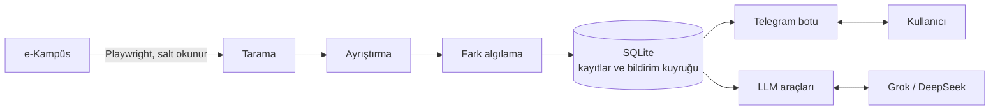

# e-Kampüs Asistanı

İstanbul Ticaret Üniversitesi e-Kampüs sistemi (Toltek TCampus) için Telegram üzerinden çalışan, ADHD dostu kişisel öğrenci asistanı.

e-Kampüs yeni bir ödev, duyuru ya da not girildiğinde öğrenciye haber vermiyor; bir şeyin değişip değişmediğini anlamak için siteye sürekli girip bakmak gerekiyor. Dikkat dağınıklığı yaşayan biri için bu, teslim tarihlerinin kaçması demek. Bu proje siteyi düzenli aralıklarla kontrol ediyor ve önemli olan her şeyi Telegram'a yazıyor. Teslimlerden önce hatırlatıyor, her sabah günün özetini çıkarıyor. Normal cümleyle sorulan sorulara da sitedeki gerçek veriye dayanarak cevap veriyor.

## Özellikler

- **Takip:** ödevler ve teslim durumu, notlar, duyurular, ders materyalleri, canlı dersler ve sınavlar.
- **Bildirim:** yeni ya da değişen her şey Telegram'a anında gelir; ödev ayrıntısı ve dosyalar mesajdaki butonlarla açılır.
- **Hatırlatma:** teslim edilmemiş ödevler için 24 ve 3 saat kala, canlı dersten 15 dakika önce; her sabah günün özeti.
- **Uyarı yöneticisi:** bildirim türlerini açıp kapatma, gece ve sessiz mod; siteye erişilemediğinde açıklamalı uyarı.
- **LLM asistanı:** Grok ya da DeepSeek ile serbest soru, ödev özetleri ve günlük plan. Her yeni bulguyu değerlendirir; gerçekten acil ya da önemliyse telefonuna öne çıkan bir uyarı gönderir. `/llmlog` ile modelin neye bakıp neye karar verdiği görülebilir.
- **Sistem izleme:** çökme, takılma, hata artışı, siteye erişilememesi ve giriş sorunları Pushover'a bildirilir; takılan bot kendini yeniden başlatır.
- **Güvenilirlik:** hiçbir bildirim kaybolmaz ya da iki kez gelmez.

## Nasıl çalışır



Bot belirli aralıklarla e-Kampüs'e girer ve ders sayfalarını, takvimi ve duyuruları okur. Okuduğu her şeyi bir önceki durumla karşılaştırır; yeni ya da değişen her kayıt bir bildirime dönüşür ve Telegram'a iletilene kadar kuyrukta bekler. Komutlar ve LLM aynı veritabanını kullanır.

Yanlış alarm vermemek için algılama temkinli çalışır:
- İlk kurulumda var olan kayıtlar bildirilmez.
- Siteden geçici olarak kaybolan bir kayıt "silindi" sayılmaz.
- Sitenin yapısı değişirse "yeni bir şey yok" denmez, uyarı verilir.

## Teknolojiler

| Alan | Kullanılan |
|---|---|
| Dil | Python 3.12+ |
| Site erişimi | Playwright (Chromium), BeautifulSoup |
| Bot | python-telegram-bot 22 (asyncio, JobQueue) |
| Veri | SQLite |
| LLM | OpenAI uyumlu API: xAI Grok, DeepSeek |
| Çalıştırma | Docker, Docker Compose, Windows Görev Zamanlayıcı |
| Test | pytest |

## Proje yapısı

```
ekampus/
  config.py      ayarlar (ortam değişkenleri)
  browser.py     Playwright oturumu ve login koruması
  scan.py        tarama turu: kaynakları okuyup kayıtları kurar
  parse.py       sayfa ayrıştırıcıları
  detect.py      önceki durumla karşılaştırma, olay üretimi
  reminders.py   teslim hatırlatma ve canlı ders kuralları
  store.py       SQLite: kayıtlar, bildirim kuyruğu, sohbet geçmişi, LLM kayıtları
  engine.py      tarama zamanlaması, sağlık uyarıları, bildirim gönderimi
  bot.py         Telegram komutları, butonlar, erişim kontrolü
  llm.py         LLM asistanı ve salt okunur araçları
  messages.py    mesaj biçimleri
  prefs.py       bildirim tercihleri
  explore.py     sitenin salt okunur keşfi (geliştirme aracı)
  doctor.py      ortam kontrolü
scripts/         sunucuya dağıtım, Windows'ta otomatik başlatma
tests/           birim testleri, sitenin yapısını taklit eden fixture'lar
docs/            site haritası
```

## Kurulum

**Gereksinimler:**
- Python 3.12 ya da üstü
- e-Kampüs (ÖBS) hesabı
- Telegram bot token'ı (@BotFather'dan)
- İsteğe bağlı: xAI ya da DeepSeek API anahtarı
- Sunucuda çalıştırmak için: Docker

### Yerel

```bash
python -m venv .venv
.venv/Scripts/python -m pip install -r requirements-dev.txt      # Linux/macOS: .venv/bin/python
.venv/Scripts/python -m playwright install chromium
cp .env.example .env                                             # sonra doldur
.venv/Scripts/python -m ekampus doctor
.venv/Scripts/python -m ekampus bot
```

Telegram'a bağlamak için `TELEGRAM_OWNER_CHAT_ID`'yi boş bırakıp botu başlat ve bota `/start` yaz. Bot sana chat ID'ni söyler; onu `.env`'e yazıp botu yeniden başlat. Bot bundan sonra yalnızca bu hesapla konuşur.

Sistem uyarılarını Pushover'a almak için pushover.net'te bir uygulama oluşturup uygulama token'ını ve kullanıcı anahtarını `.env`'e yaz; `doctor` anahtarları doğrular, `test-notify --olay pushover` deneme gönderir.

Windows'ta oturum açılınca arka planda başlaması için:

```powershell
powershell -ExecutionPolicy Bypass -File scripts\windows-autostart.ps1     # kaldırmak için: -Remove
```

### Sunucu (Docker)

```bash
DEPLOY_HOST=root@SUNUCU DEPLOY_KEY=~/.ssh/anahtar scripts/deploy.sh --env   # ilk kurulum
DEPLOY_HOST=root@SUNUCU DEPLOY_KEY=~/.ssh/anahtar scripts/deploy.sh         # güncelleme
```

Betik kodu sunucuya gönderip orada derler ve botu yeniden başlatır; `--env` ile yapılandırma dosyası da SSH üzerinden aktarılır. Sunucu yeniden başlarsa bot kendiliğinden kalkar.

### Yapılandırma

Bütün ayarlar `.env` dosyasında durur; tam liste `.env.example` içinde.

| Değişken | Açıklama | Varsayılan |
|---|---|---|
| `EKAMPUS_USERNAME`, `EKAMPUS_PASSWORD` | ÖBS kullanıcı adı ve şifresi | |
| `TELEGRAM_BOT_TOKEN`, `TELEGRAM_OWNER_CHAT_ID` | Bot token'ı ve botun konuşacağı tek hesap | |
| `LLM_PROVIDER`, `LLM_API_KEY`, `LLM_MODEL` | `xai` ya da `deepseek`, API anahtarı, model | `deepseek`, boş, otomatik |
| `PUSHOVER_APP_TOKEN`, `PUSHOVER_USER_KEY` | Sistem uyarıları için Pushover; boşsa uyarılar Telegram'a gider | boş |
| `ERROR_SPIKE_PER_HOUR` | Bir saatte kaç hata birikince "hata artışı" uyarısı gelir | 5 |
| `LLM_DAILY_TOKEN_BUDGET` | Günlük token sınırı | 200000 |
| `LLM_HISTORY_MESSAGES` | Her soruda modele tekrar gönderilen son mesaj sayısı | 20 |
| `LLM_ALERTS_PER_DAY` | LLM'in günde gönderebileceği öne çıkan uyarı sayısı (0 = kapalı) | 3 |
| `POLL_INTERVAL_MIN`, `NIGHT_POLL_INTERVAL_MIN` | Gündüz ve gece kontrol aralığı (dakika) | 15, 60 |
| `NIGHT_HOURS` | Acil olmayan bildirimlerin sabaha bekletildiği saatler | 01:00-07:00 |
| `DAILY_DIGEST_TIME` | Sabah özetinin saati | 08:00 |
| `REMINDER_HOURS` | Teslimden kaç saat önce hatırlatılacağı | 24,3 |

## Kullanım

| Komut | Açıklama |
|---|---|
| `/bugun`, `/hafta`, `/takvim` | Bugün ve yarın, önümüzdeki 7 gün, önümüzdeki 30 gün |
| `/odevler` | Açık ödevler, teslim tarihine göre sıralı |
| `/notlar`, `/duyurular`, `/dersler` | Notlar, son duyurular, dersler ve ilerleme durumu |
| `/dosyalar [ders]` | Ders seçilir, o dersin materyalleri bölümlere göre biçimleriyle (PDF, ZIP, PowerPoint…) listelenir; dokunulan materyal dosya olarak gönderilir |
| `/bildirimler` | Uyarı yöneticisi: sistem durumu, bildirim türleri, gece modu, sessiz mod, geçmiş |
| `/sessiz 2s` | Acil olmayan bildirimleri belirli bir süre beklet (`30dk`, `1g`, `kapat`) |
| `/yenile`, `/durum` | Siteyi hemen kontrol et; son ve sonraki kontrol, giriş ve kuyruk durumu |
| `/llmlog`, `/unut` | LLM'in son cevapta baktığı veriler; sohbet geçmişini silme |
| `/girisdene` | Reddedilen bir girişten sonra login kilidini kaldırıp tekrar dene |

Komutların dışında bota normal cümleyle de yazılabilir. LLM bağlıysa soruyu o cevaplar; bağlı değilse "ödev", "bugün", "not" gibi kelimeler ilgili komutu çalıştırır.

## Güvenlik ve gizlilik

- **Salt okunur:** Bot e-Kampüs'e hiçbir şey yazmaz; ödev teslim etmez, form göndermez.
- **Hesap güvenliği:** Şifre reddedilirse giriş tekrar denenmez, böylece hesap kilitlenmez.
- **Tek kullanıcı:** Bot yalnızca sahibine cevap verir; başkalarının mesajlarını yanıtsız bırakır ve sahibine bildirir.
- **Gizli bilgiler:** Şifre, token ve API anahtarı sadece `.env` dosyasında durur, repoya girmez.
- **LLM:** Model yalnızca ödev, not ve takvim gibi ders verilerini görür; kimlik bilgilerine erişimi yoktur. Uyarı göndermesi soyut bir araçla olur: model hangi kanalın kullanıldığını ve anahtarları bilmez, sadece sana gönderebilir ve günlük sınırı vardır.

## Geliştirme

```bash
.venv/Scripts/python -m pytest                      # testler
.venv/Scripts/python -m ekampus doctor              # ortam ve bağlantı kontrolü
.venv/Scripts/python -m ekampus check --dry-run     # tek tarama, durumu değiştirmeden
.venv/Scripts/python -m ekampus test-notify --olay odev   # örnek bildirimi botun hattından geçir
```

Sitenin yapısı, kullanılan adresler ve dikkat edilmesi gereken noktalar [docs/site-map.md](docs/site-map.md) dosyasında.

## Yol haritası

- LLM için uzun süreli hafıza
- Duyuru, sanal sınıf ve sınav kayıtlarının gerçek veriyle doğrulanması
