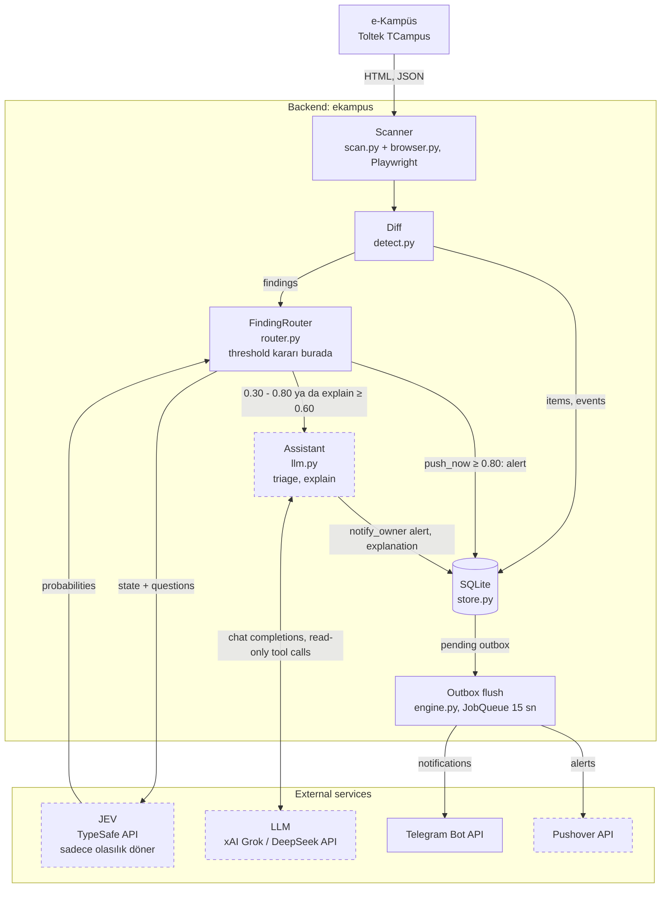
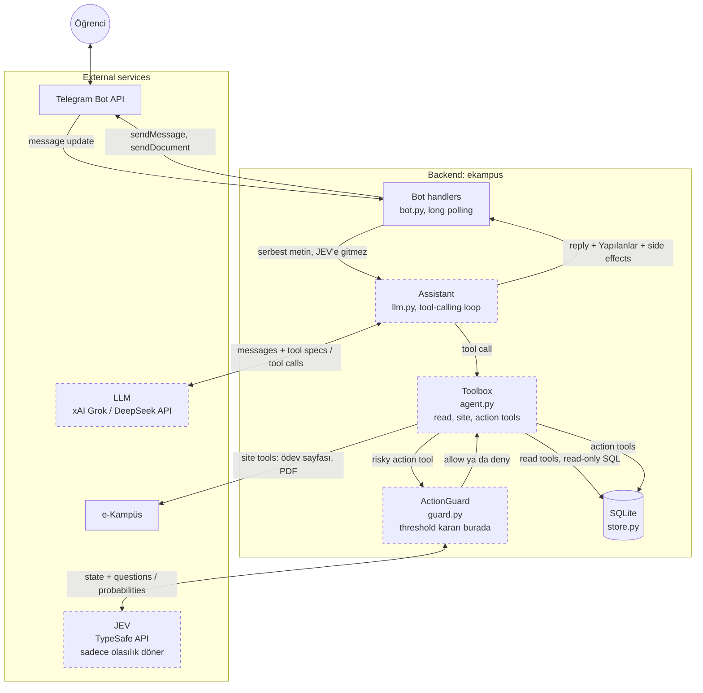

# e-Kampüs Asistanı

İstanbul Ticaret Üniversitesi e-Kampüs sistemi (Toltek TCampus) için Telegram üzerinden çalışan, ADHD dostu kişisel öğrenci asistanı.

e-Kampüs yeni bir ödev, duyuru ya da not girildiğinde öğrenciye haber vermiyor. Bir şeyin değişip değişmediğini anlamak için siteye sürekli girip bakmak gerekiyor; dikkat dağınıklığı yaşayan biri için bu, kaçan teslim tarihleri demek.

Bu proje siteyi düzenli aralıklarla kontrol eder ve önemli olan her şeyi Telegram'a yazar. Teslimlerden önce hatırlatır, her sabah günün özetini çıkarır. Sohbete normal cümleyle yazılan her şeyi bir LLM agent karşılar: sitedeki gerçek veriye bakarak cevap verir, botu da yönetir. Örneğin "cuma 18'e kadar rahatsız etme", "yarın 10'da raporu hatırlat" ya da "Ağlar'ı bıraktım, aklında olsun" demek yeter.

## Özellikler

- **Takip:** Ödevler ve teslim durumu, notlar, duyurular, ders materyalleri, canlı dersler ve sınavlar.
- **Bildirim:** Yeni ya da değişen her şey Telegram'a anında gelir. Ödev ayrıntısı ve dosyalar mesajdaki butonlarla açılır.
- **Hatırlatma:**
  - Teslim edilmemiş ödevler için 24 ve 3 saat kala, canlı dersten 15 dakika önce.
  - Her sabah günün özeti.
  - Öğrencinin kendi kurduğu saatli hatırlatmalar.
- **LLM agent:** Sohbete yazılan mesajı Grok ya da DeepSeek tool calling ile cevaplar ve botu yönetir:
  - **Site:** Siteyi hemen kontrol edip yeni gelenleri tek tek söyler. Ödev sayfasını canlı açar, ekleri ve materyalleri (bir seferde 10'a kadar) gönderir. Kilitlenen girişi tekrar dener.
  - **Belgeler:** PDF materyalleri ve ödev eklerini okur, içinden soru cevaplar, kaynak sayfayı söyler. PDF gönderdiğinde okumayı teklif eder; gönderilen PDF'nin altında "Oku ve özetle" butonu çıkar.
  - **Bildirimler:** Belirli bir saate kadar sessiz mod (acil olanlar gelsin ya da hiçbir şey gelmesin). Bildirim türlerini, özellikleri ve tek bir dersi kapatıp açar. Biriken bildirimleri gösterip hemen gönderir, geçmiş bir bildirimi tekrar yollar.
  - **Hatırlatmalar:** Saatli hatırlatma kurar, erteler, iptal eder. Bir ödev için ek hatırlatma kurar ("1 saat kala da") ya da otomatik hatırlatmalarını susturur. Ödevi "teslim ettim" olarak işaretler.
  - **Durum ve ayarlar:** Aktif hatırlatma takvimini, botun durumunu ve veritabanını gösterir; veritabanına salt okunur SQL ile bakar. Sabah özetini hemen gönderir, özet ve gece saatlerini değiştirir, erişim uyarısı eşiğini ayarlar.

  Yaptığı her değişiklik cevabın altında "Yapılanlar" olarak listelenir.
- **Kalıcı hafıza:** Agent, öğrencinin söylediği kalıcı tercihleri ve bilgileri (bırakılan ders, çalışma saatleri…) kendisi kaydeder ve sonraki her cevapta dikkate alır. Notlar `/hafiza`'dan görülür ve silinir.
- **JEV (TypeSafe):** İki yerde kullanılır; JEV sadece olasılık döner, kararı backend threshold'larla verir.
  - **Finding triage:** Her yeni finding için teslim, sınav, tarih değişikliği, açıklama ihtiyacı ve "hemen uyarılsın mı" olasılıklarını verir. Emin olunan finding'ler doğrudan alert olur, kararsızlar LLM'e gider.
  - **Action guardrail:** Agent riskli bir action tool çağırdığında, tool çalışmadan önce JEV'e "öğrenci bunu açıkça istedi mi, riskli mi" diye sorulur. İstenmemiş riskli action yapılmaz, agent öğrenciye sorar. Human-in-the-loop yoktur; bir öneriyi "evet" diye onaylamak da istek sayılır.
- **Uyarı yöneticisi:** Bildirim türleri açılıp kapatılabilir; gece modu ve iki seviyeli sessiz mod vardır. Siteye erişilemediğinde açıklamalı uyarı gelir.
- **Sistem izleme:** Çökme, takılma, hata artışı, siteye erişilememesi ve giriş sorunları Pushover'a bildirilir. Takılan bot kendini yeniden başlatır.
- **İsteğe bağlı özellikler:** LLM, JEV ve Pushover anahtarı varsa çalışır ve `/ayarlar`'dan açılıp kapatılır. Anahtarı olmayan özelliği bot açılışta, `/durum`'da ve `/ayarlar`'da "çalışmıyor: .env'de X yok" diye bildirir. Bot bunların hiçbiri olmadan da takip, bildirim ve hatırlatma yapar.
- **Güvenilirlik:** Hiçbir bildirim kaybolmaz ya da iki kez gelmez.

## Nasıl çalışır

Backend tek bir Python process'idir ve Docker container'ında (`ekampus`) çalışır: Telegram bot (long polling), JobQueue ile zamanlanmış işler (scan, outbox flush, reminder, digest), scanner, LLM agent ve SQLite. Ayrı bir web servisi ya da worker yoktur. Dışarıdaki her şey HTTP üzerinden konuşulan external service'tir.

| Bileşen | Nerede | Görevi |
|---|---|---|
| Scanner (`scan.py`, `browser.py`) | Backend, Playwright/Chromium | e-Kampüs'e girer, sayfaları ve JSON endpoint'lerini okur (salt okunur) |
| Diff (`detect.py`) | Backend | Okunanı önceki durumla karşılaştırır, event üretir |
| Store (`store.py`) | Backend, SQLite | Kayıtlar, outbox, sohbet geçmişi, hafıza, okunmuş PDF'ler, LLM log'ları |
| Outbox flush (`engine.py`) | Backend, JobQueue | Bekleyen bildirimleri gönderir; sessiz mod, gece modu, kategori ve ders filtreleri burada uygulanır |
| FindingRouter (`router.py`) | Backend | Finding'leri JEV'e sorar, threshold'larla alert / LLM / explain kararını verir |
| Assistant (`llm.py`) | Backend | LLM'i tool-calling loop ile çalıştırır (sohbet, triage, explain, digest planı) |
| Toolbox (`agent.py`) | Backend | Tool tanımları ve çalıştırılması: read, site ve action tool'ları |
| ActionGuard (`guard.py`) | Backend | Riskli action tool'dan önce JEV'e sorar, threshold'larla allow / deny verir |
| Bot handlers (`bot.py`) | Backend | Komutlar, butonlar, sohbet; agent'ın istediği dosya ve bildirimleri gönderir |
| Watchdog (`watchdog.py`) | Backend, ayrı thread | Event loop takılırsa process'i kapatır, Docker yeniden başlatır |
| JEV | External service: TypeSafe API | State + sorulara olasılık döner, karar vermez |
| LLM | External service: xAI Grok ya da DeepSeek API | Metin ve tool call üretir |
| Telegram | External service: Telegram Bot API | Öğrenciyle tek kanal |
| Pushover | External service: Pushover API | Alert'lerin telefona gitmesi |

### Finding pipeline



Scanner belirli aralıklarla e-Kampüs'ü okur. Diff yeni ya da değişen her kaydı bir event yapar ve outbox'a yazar; outbox flush bunları Telegram'a gönderir. Yeni finding'ler ayrıca FindingRouter'a gider:
- **`push_now` ≥ 0.80:** Backend alert'i kendisi outbox'a koyar, Pushover'a gider. Bu karar için LLM'e gidilmez.
- **0.30 < `push_now` < 0.80:** Karar LLM'e bırakılır; LLM read-only tool'larla bağlama bakıp gerekirse `notify_owner` ile alert gönderir.
- **`needs_explanation` ≥ 0.60:** LLM kısa bir açıklama yazar, asıl bildirimden sonra gelir.
- **`push_now` ≤ 0.30:** Sadece normal bildirim gelir.

### Chat pipeline



Sohbete yazılan mesaj JEV'e gitmez; bot handler doğrudan Assistant'a verir. Assistant LLM'i tool-calling loop ile çalıştırır, LLM'in istediği tool'ları Toolbox yürütür:
- **Read tools:** Kayıtlar, ajanda, reminder takvimi, botun durumu, read-only SQL.
- **Site tools:** Ödev sayfası, PDF okuma.
- **Action tools:** Sessiz mod, ayarlar, reminder'lar, hafıza, dosya ve bildirim gönderme.

Risksiz action'lar hemen yapılır; riskli olanlar önce ActionGuard'dan geçer. Yapılan her action cevabın altında "Yapılanlar" olarak listelenir. Dosya gönderme gibi side effect'leri bot handler cevaptan sonra yapar.

### JEV'in iki kullanımı

| | Finding triage | Action guardrail |
|---|---|---|
| Çağıran (backend) | `router.py` FindingRouter | `guard.py` ActionGuard |
| Ne zaman | Her yeni ya da değişen finding | Riskli bir action tool çalışmadan hemen önce |
| JEV'e giden state | Finding metni ve backend'in hesapladığı gerçekler (kalan saat, teslim durumu, tarih öne mi alındı) | Öğrencinin mesajı, son birkaç mesaj, önerilen tool ve argümanları |
| Sorular (noul) | `requires_submission`, `exam_related`, `schedule_change`, `action_required`, `needs_explanation`, `push_now` | `explicitly_requested`, `risky` |
| Kararı veren | Backend: `push_now` ≥ 0.80 alert, 0.30-0.80 LLM, ≤ 0.30 yok; `needs_explanation` ≥ 0.60 explain | Backend: `explicitly_requested` ≥ 0.60 allow; değilse `risky` < 0.25 allow, aksi halde deny |
| JEV kapalıysa | Finding'ler doğrudan LLM'e gider | Guardrail atlanır, action yapılır |
| LLM kapalıysa | Kararsız finding'ler kaçmasın diye alert olur | Sohbet agent'ı da kapalıdır |

Triage threshold'ları `.env`'den ayarlanır (`JEV_PUSH_HIGH`, `JEV_PUSH_LOW`, `JEV_EXPLAIN_MIN`). Bütün kararlar `/llmlog`'da olasılıklarıyla görünür.

**Kesik çerçeveli bileşenler isteğe bağlıdır:** JEV, LLM ve Pushover anahtarı yoksa ya da `/ayarlar`'dan kapatılmışsa devre dışı kalır ve bot bunu söyler. Pushover kapalıysa alert'ler Telegram'a gelir.

**Prompt injection:** Finding pipeline'ında LLM'e site ve action tool'ları verilmez. Böylece site metnine gömülü bir talimat botun ayarlarını değiştiremez.

Yanlış alarm vermemek için algılama temkinli çalışır:
- İlk kurulumda var olan kayıtlar bildirilmez.
- Siteden geçici olarak kaybolan bir kayıt "silindi" sayılmaz.
- Sitenin yapısı değişirse "yeni bir şey yok" denmez, uyarı verilir.

## Teknolojiler

| Alan | Kullanılan |
|---|---|
| Dil | Python 3.12+ |
| Site erişimi | Playwright (Chromium), BeautifulSoup |
| Bot | python-telegram-bot 22 (asyncio, JobQueue) |
| Veri | SQLite |
| LLM | OpenAI uyumlu API: xAI Grok, DeepSeek |
| Finding triage, action guardrail | TypeSafe JEV |
| Belge okuma | pypdf |
| Uyarılar | Pushover (httpx) |
| Çalıştırma | Docker, Docker Compose, Windows Görev Zamanlayıcı |
| Test | pytest |

## Proje yapısı

```
ekampus/
  config.py      ayarlar (ortam değişkenleri)
  features.py    isteğe bağlı özellikler: anahtar ve aç/kapa durumu
  browser.py     Playwright oturumu ve login koruması
  scan.py        tarama turu: kaynakları okuyup kayıtları kurar
  parse.py       sayfa ayrıştırıcıları
  detect.py      önceki durumla karşılaştırma, olay üretimi
  reminders.py   teslim hatırlatma ve canlı ders kuralları
  store.py       SQLite: kayıtlar, outbox, sohbet geçmişi, hafıza, PDF cache, LLM log'ları
  engine.py      tarama zamanlaması, sağlık uyarıları, sessiz mod, bildirim gönderimi
  jev.py         JEV client ve finding'in JEV'e giden state'i
  router.py      FindingRouter: JEV olasılıklarına göre alert / LLM / explain
  agent.py       Toolbox: agent'ın read, site ve action tool'ları
  guard.py       ActionGuard: riskli action tool'dan önce JEV guardrail
  documents.py   PDF'den sayfa sayfa metin
  llm.py         Assistant: sohbet, finding triage, explain, digest planı
  pushover.py    Pushover istemcisi
  watchdog.py    watchdog thread: takılan process'i yeniden başlatır
  bot.py         Telegram komutları, butonlar, erişim kontrolü
  messages.py    mesaj biçimleri
  prefs.py       bildirim tercihleri
  explore.py     sitenin salt okunur keşfi (geliştirme aracı)
  doctor.py      ortam kontrolü
scripts/         sunucuya dağıtım, Windows'ta otomatik başlatma
tests/           birim testleri, sitenin yapısını taklit eden fixture'lar
docs/            site haritası
```

## Kurulum

**Gereksinimler:**
- Python 3.12 ya da üstü
- e-Kampüs (ÖBS) hesabı
- Telegram bot token'ı (@BotFather'dan)
- Sunucuda çalıştırmak için: Docker

**İsteğe bağlı (anahtarı yoksa o özellik çalışmaz, bot da bunu söyler):**
- xAI ya da DeepSeek API anahtarı: LLM agent
- TypeSafe API anahtarı: JEV
- Pushover uygulama token'ı ve kullanıcı anahtarı: telefona uyarı

### Yerel

```bash
python -m venv .venv
.venv/Scripts/python -m pip install -r requirements-dev.txt      # Linux/macOS: .venv/bin/python
.venv/Scripts/python -m playwright install chromium
cp .env.example .env                                             # sonra doldur
.venv/Scripts/python -m ekampus doctor
.venv/Scripts/python -m ekampus bot
```

**Telegram'a bağlama:**
1. `TELEGRAM_OWNER_CHAT_ID`'yi boş bırakıp botu başlat ve bota `/start` yaz.
2. Bot sana chat ID'ni söyler; onu `.env`'e yazıp botu yeniden başlat.

Bot bundan sonra yalnızca bu hesapla konuşur.

**Pushover:** Sistem uyarılarını Pushover'a almak için pushover.net'te bir uygulama oluştur; uygulama token'ını ve kullanıcı anahtarını `.env`'e yaz. `doctor` anahtarları doğrular, `test-notify --olay pushover` deneme gönderir.

**JEV:** JEV'i denemek için `TYPESAFE_API_KEY`'i yaz. `jev-test` örnek finding'lerde JEV'in olasılıklarını ve FindingRouter'ın kararını gösterir; hiçbir şey göndermez.

Windows'ta oturum açılınca arka planda başlaması için:

```powershell
powershell -ExecutionPolicy Bypass -File scripts\windows-autostart.ps1     # kaldırmak için: -Remove
```

### Sunucu (Docker)

```bash
DEPLOY_HOST=root@SUNUCU DEPLOY_KEY=~/.ssh/anahtar scripts/deploy.sh --env   # ilk kurulum ya da .env değişince
DEPLOY_HOST=root@SUNUCU DEPLOY_KEY=~/.ssh/anahtar scripts/deploy.sh         # güncelleme
```

Betik kodu sunucuya gönderir, orada derler ve botu yeniden başlatır. `--env` ile yapılandırma dosyası da SSH üzerinden aktarılır. Sunucu yeniden başlarsa bot kendiliğinden kalkar.

### Yapılandırma

Bütün ayarlar `.env` dosyasında durur; tam liste `.env.example` içinde.

| Değişken | Açıklama | Varsayılan |
|---|---|---|
| `EKAMPUS_USERNAME`, `EKAMPUS_PASSWORD` | ÖBS kullanıcı adı ve şifresi | |
| `TELEGRAM_BOT_TOKEN`, `TELEGRAM_OWNER_CHAT_ID` | Bot token'ı ve botun konuşacağı tek hesap | |
| `LLM_PROVIDER`, `LLM_API_KEY`, `LLM_MODEL` | `xai` ya da `deepseek`, API anahtarı, model; anahtar yoksa LLM agent çalışmaz | `deepseek`, boş, otomatik |
| `TYPESAFE_API_KEY` | JEV (finding triage ve action guardrail); boşsa finding'lere LLM karar verir, guardrail atlanır | boş |
| `PUSHOVER_APP_TOKEN`, `PUSHOVER_USER_KEY` | Uyarılar için Pushover; boşsa uyarılar Telegram'a gider | boş |
| `LLM_DAILY_TOKEN_BUDGET` | Günlük token sınırı | 200000 |
| `LLM_HISTORY_MESSAGES` | Her soruda modele tekrar gönderilen son mesaj sayısı | 20 |
| `LLM_ALERTS_PER_DAY` | Günde gönderilebilecek öne çıkan asistan uyarısı sayısı (0 = kapalı) | 3 |
| `JEV_PUSH_HIGH`, `JEV_PUSH_LOW` | JEV'in uyarıyı kendisi göndereceği ve kararı LLM'e bırakacağı olasılık sınırları | 0.8, 0.3 |
| `JEV_EXPLAIN_MIN` | LLM'in açıklama yazması için gereken olasılık | 0.6 |
| `ERROR_SPIKE_PER_HOUR` | Bir saatte kaç hata birikince "hata artışı" uyarısı gelir | 5 |
| `POLL_INTERVAL_MIN`, `NIGHT_POLL_INTERVAL_MIN` | Gündüz ve gece kontrol aralığı (dakika) | 15, 60 |
| `NIGHT_HOURS` | Acil olmayan bildirimlerin sabaha bekletildiği saatler | 01:00-07:00 |
| `DAILY_DIGEST_TIME` | Sabah özetinin saati | 08:00 |
| `REMINDER_HOURS` | Teslimden kaç saat önce hatırlatılacağı | 24,3 |

## Kullanım

| Komut | Açıklama |
|---|---|
| `/bugun`, `/hafta`, `/takvim` | Bugün ve yarın, önümüzdeki 7 gün, önümüzdeki 30 gün |
| `/odevler` | Açık ödevler, teslim tarihine göre sıralı |
| `/notlar`, `/duyurular`, `/dersler` | Notlar, son duyurular, dersler ve ilerleme durumu |
| `/dosyalar [ders]` | Önce ders seçilir; o dersin materyalleri bölümlere göre, biçimleriyle (PDF, ZIP, PowerPoint…) listelenir. Dokunulan materyal dosya olarak gönderilir |
| `/bildirimler` | Uyarı yöneticisi: sistem durumu, bildirim türleri, gece modu, sessiz mod, geçmiş |
| `/ayarlar` | LLM, JEV ve Pushover'ı aç/kapa; hafıza ve hatırlatmalara geçiş |
| `/hafiza` | LLM'in senin hakkında hatırladıkları; tek tek ya da hepsini silme |
| `/hatirlatmalar` | Kurduğun saatli hatırlatmalar ve iptal |
| `/sessiz 2s` | Acil olmayan bildirimleri belirli bir süre beklet (`30dk`, `1g`, `kapat`) |
| `/yenile`, `/durum` | Siteyi hemen kontrol et; son ve sonraki kontrol, giriş, outbox ve özelliklerin durumu |
| `/llmlog`, `/unut` | LLM'in son cevapta baktığı veriler ve yaptığı eylemler; sohbet geçmişini silme (hafıza kalır) |
| `/girisdene` | Reddedilen bir girişten sonra login kilidini kaldırıp tekrar dene |

**Komutların dışında bota normal cümleyle de yazılabilir:**
- "yeni bir şey var mı bak"
- "bu hafta neye odaklanayım?", "aktif hatırlatmalarım neler?"
- "cuma 18'e kadar rahatsız etme, acil olsa bile", "sessizdeyken neler birikti, şimdi gönder"
- "yarın 10'da Ağlar raporunu hatırlat", "bunu 1 saat ertele", "Homework 4 için 2 saat kala da hatırlat"
- "Homework 4'ün eklerini at", "lecture 3'ü oku, sınav ne zaman yazıyor?"
- "ağlar dersinin bütün slaytlarını at"
- "Lab Raporu 2'yi teslim ettim", "Fizik dersinden bildirim gelmesin", "duyuruları kapat"
- "sabah özeti 9'da gelsin", "dünkü duyuruyu tekrar at"
- "Ağlar'ı bıraktım, aklında olsun"

LLM kapalıysa "ödev", "bugün", "not" gibi kelimeler ilgili komutu çalıştırır.

## Güvenlik ve gizlilik

- **Salt okunur:** Bot e-Kampüs'e hiçbir şey yazmaz; ödev teslim etmez, form göndermez.
- **Hesap güvenliği:** Şifre reddedilirse giriş tekrar denenmez, böylece hesap kilitlenmez.
- **Tek kullanıcı:** Bot yalnızca sahibine cevap verir. Başkalarının mesajlarını yanıtsız bırakır ve sahibine bildirir.
- **Gizli bilgiler:** Şifre, token ve API anahtarı sadece `.env` dosyasında durur, repoya girmez.
- **LLM ve JEV:**
  - İkisi de yalnızca ödev, not, duyuru ve takvim gibi ders verilerini görür; kimlik bilgilerine ve anahtarlara erişimleri yoktur. Bu veriler kullanılan LLM sağlayıcısına ve TypeSafe'e gider.
  - Alert göndermesi soyut bir tool (`notify_owner`) ile olur: model kanalın nasıl çalıştığını ve anahtarları bilmez, sadece sana gönderebilir ve günlük sınırı vardır.
- **Agent action'ları:**
  - Agent sadece sohbette, senin mesajına cevap verirken action yapar; finding triage'da site ve action tool'ları ona hiç verilmez.
  - Riskli action'lardan önce JEV guardrail'e "öğrenci bunu açıkça istedi mi" diye sorulur; istenmemiş riskli action deny edilir.
  - Zamanlar ve sınırlar backend'de doğrulanır.
  - SQL sorguları read-only'dir: SQLite authorizer yazmayı reddeder, uzun sorgu kesilir.
  - Her değişiklik cevabın altında listelenir. `/llmlog`'da action'lar "[eylem]", guardrail kontrolleri de "JEV eylem kontrolü" kaydı olarak görünür.

## Geliştirme

```bash
.venv/Scripts/python -m pytest                      # testler
.venv/Scripts/python -m ekampus doctor              # ortam ve bağlantı kontrolü
.venv/Scripts/python -m ekampus check --dry-run     # tek tarama, durumu değiştirmeden
.venv/Scripts/python -m ekampus test-notify --olay odev   # örnek bildirimi botun gönderim yolundan geçir
.venv/Scripts/python -m ekampus jev-test            # örnek finding'lerde JEV kararları
```

Sitenin yapısı, kullanılan adresler ve dikkat edilmesi gereken noktalar [docs/site-map.md](docs/site-map.md) dosyasında.

## Yol haritası

- Duyuru, sanal sınıf ve sınav kayıtlarının gerçek veriyle doğrulanması
